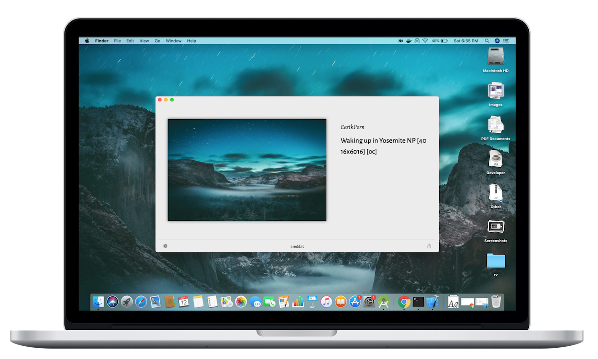

# Muzei-macOS

Wallpaper app for macOS inspired by [Muzei live wallpaper](https://github.com/romannurik/muzei) for Android by Roman Nurik.

Muzei is a menu bar app that lets you use daily updated famous works of art as the wallpaper.
Muzei also supports using top scoring images from Reddit and [Unsplash](https://unsplash.com) as the wallpaper. Customisation options like blurring, dimming and specifying the subreddit are present.

 

Download from [Releases](https://github.com/naman14/Muzei-macOS/releases)

### Screenshots

## Building

Install dependencies using [cocoapods](https://cocoapods.org):

`$ pod install`

Then open repository with Xcode:

`$ open MuzeiOSX.xcworkspace`

## Credits
   [Roman Nurik](https://github.com/romannurik) - Author of Muzei live wallpaper for Android.

## License

>(c) 2017 Naman Dwivedi 

>This is free software: you can redistribute it and/or modify it under the terms of the GNU General Public License as published by the Free Software Foundation, either version 3 of the License, or (at your option) any later version. 

>This software is distributed in the hope that it will be useful, but WITHOUT ANY WARRANTY; without even the implied warranty of MERCHANTABILITY or FITNESS FOR A PARTICULAR PURPOSE. See the GNU General Public License for more details. 

>You should have received a copy of the GNU General Public License along with this app. If not, see <https://www.gnu.org/licenses/>.
